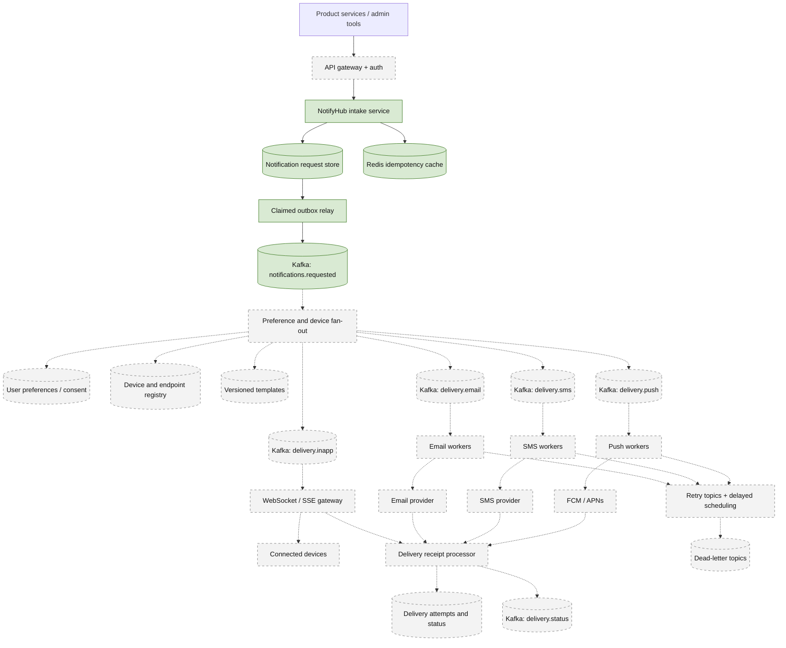
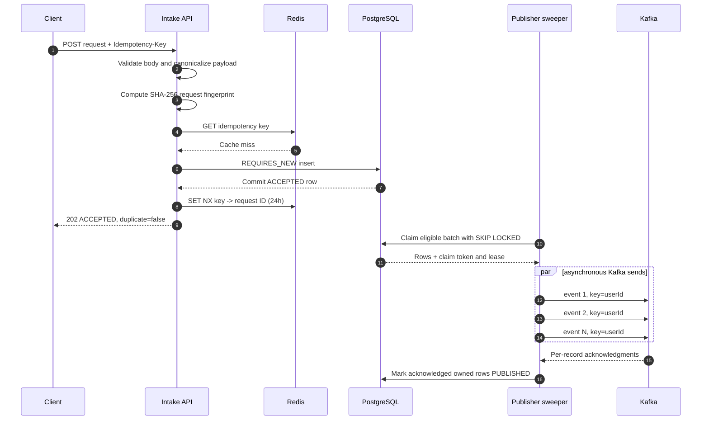
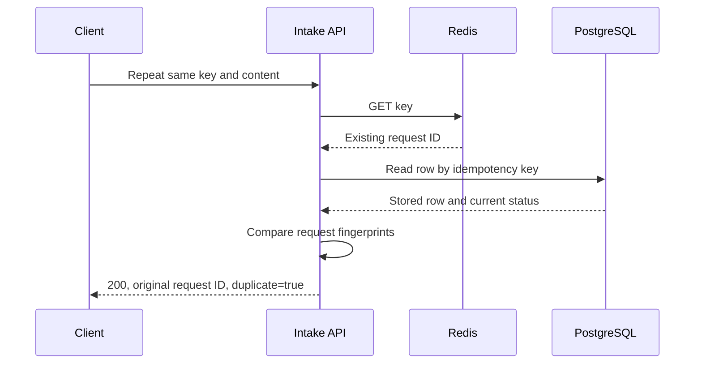
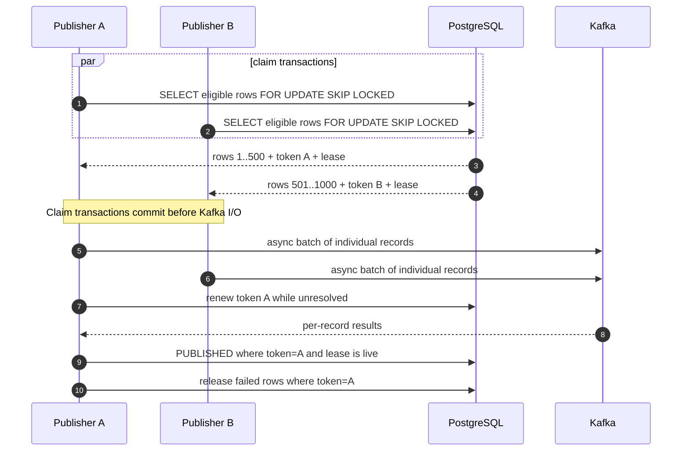
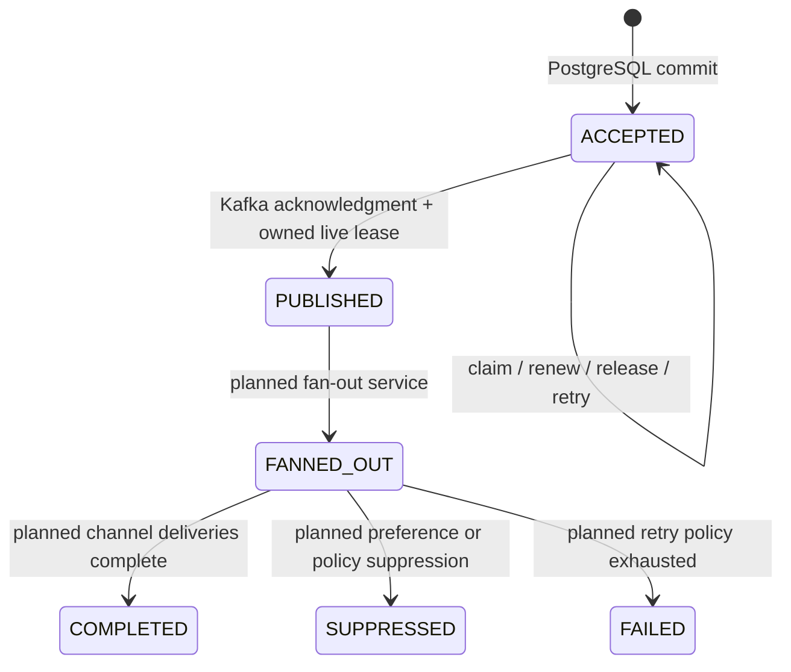

# NotifyHub

NotifyHub is a Java and Spring Boot notification-platform design exercise. Its
goal is to explore the reliability and scaling problems behind a service that
eventually delivers push, SMS, email, and in-app notifications while respecting
user preferences and device registrations.

The current code completes the **Phase 1 ingestion and durable publication
pipeline**. It accepts idempotent notification requests, persists them in
PostgreSQL, uses Redis as an optional duplicate-detection accelerator, and
publishes accepted requests to Kafka in asynchronously acknowledged batches.
Multiple publisher instances coordinate through PostgreSQL leases and
`FOR UPDATE SKIP LOCKED`.

This repository deliberately distinguishes implemented behavior from future
architecture. The target traffic numbers are design inputs, not benchmark
claims.

## Current status

| Capability | Status | Notes |
| --- | --- | --- |
| Notification intake API | Implemented | `POST /v1/notifications` |
| Request validation | Implemented | Bean Validation with structured `400` errors |
| Durable request storage | Implemented | PostgreSQL + Flyway |
| Idempotent request handling | Implemented | Redis fast path, PostgreSQL source of truth |
| Idempotency content validation | Implemented | Canonical SHA-256 request fingerprint |
| Redis outage degradation | Implemented | Requests fall back to PostgreSQL |
| Batched Kafka publication | Implemented | Async sends with grouped status updates |
| Multi-instance publisher coordination | Implemented | Lease token + expiry + `SKIP LOCKED` |
| Metrics endpoints | Partially implemented | Actuator and Prometheus registry are present |
| Scheduled delivery | Data captured only | `scheduledAt` is stored and published but not enforced |
| User preferences and opt-out | Planned | Phase 2 |
| Device registration | Planned | Phase 2 |
| Channel fan-out | Planned | Phase 2 |
| Email, SMS, push adapters | Planned | Phase 2 |
| In-app real-time delivery | Planned | Phase 2 |
| Delivery receipts and provider callbacks | Planned | Phase 2 |
| Retries, backoff, and dead-letter queues | Planned | Phase 2 |
| Load-test evidence for target volumes | Not yet measured | A benchmark suite is required |

## Design goals

The long-term scenario uses the following daily volumes:

| Channel | Notifications/day | Average rate |
| --- | ---: | ---: |
| Push | 10,000,000 | 115.7/second |
| Email | 5,000,000 | 57.9/second |
| SMS | 1,000,000 | 11.6/second |
| **Total** | **16,000,000** | **185.2/second** |

The average is not a sufficient capacity target. A launch, security incident,
or scheduled campaign can produce a much higher peak. At a hypothetical 10x
peak, intake and fan-out must sustain about 1,852 logical notifications/second
before retries and multi-device expansion. One logical push notification can
produce several provider deliveries if a user owns several devices.

The system is designed around these principles:

- Accept requests quickly and perform delivery asynchronously.
- Treat PostgreSQL as the durable source of truth.
- Treat Redis as an optimization whose outage must not lose accepted work.
- Use idempotency at every asynchronous boundary.
- Prefer at-least-once processing with explicit deduplication over hidden loss.
- Partition Kafka records by user to preserve per-user partition ordering.
- Isolate provider-specific throughput limits and failure modes behind workers.
- Make current implementation limits visible instead of presenting estimates as
  measured capacity.

## Implemented architecture

```mermaid
flowchart LR
    Client[API client] -->|POST /v1/notifications| Controller[NotificationController]
    Controller --> Validation[Bean Validation]
    Validation --> Fingerprint[Canonical request fingerprint]
    Fingerprint --> Cache[(Redis<br/>optional fast path)]
    Fingerprint --> Service[NotificationService]
    Cache -. hit hint .-> Service
    Service -->|REQUIRES_NEW insert/read| DB[(PostgreSQL)]
    DB -->|ACCEPTED rows| Claims[NotificationClaims]
    Claims -->|claim token + lease<br/>SKIP LOCKED| DB
    Claims --> Sweeper[NotificationSweeper]
    Sweeper -->|async records keyed by userId| Kafka[(Kafka<br/>notifications.requested)]
    Kafka -->|broker acknowledgment| Sweeper
    Sweeper -->|PUBLISHED or release claim| Claims

    classDef durable fill:#d9ead3,stroke:#38761d,color:#111;
    classDef optional fill:#fff2cc,stroke:#bf9000,color:#111;
    classDef service fill:#d9eaf7,stroke:#0b5394,color:#111;
    class DB,Kafka durable;
    class Cache optional;
    class Controller,Validation,Fingerprint,Service,Claims,Sweeper service;
```



### Component responsibilities

| Component | Responsibility |
| --- | --- |
| `NotificationController` | HTTP contract, required idempotency header, `202` versus `200` response |
| `ApiExceptionHandler` | Structured validation errors and `409` idempotency conflicts |
| `RequestFingerprint` | Canonicalizes request content and computes a SHA-256 fingerprint |
| `IdempotencyService` | Stores and retrieves a 24-hour Redis key-to-request-ID hint |
| `NotificationService` | Orchestrates cache lookup, durable insert, duplicate recovery, and conflict checks |
| `NotificationPersistence` | Creates clean transaction boundaries for insert and duplicate lookup |
| `NotificationRequestRepository` | JPA access for durable requests and test/support queries |
| `NotificationClaims` | Atomically claims, renews, releases, and completes publisher leases |
| `NotificationSweeper` | Owns one bounded in-flight batch and reacts to Kafka futures |
| `NotificationProducer` | Sends one Kafka record per notification, keyed by `userId` |
| Flyway | Owns schema history and validates JPA against the database schema |

## Intended end-state architecture

The following diagram is the Phase 2+ design direction. Dashed components are
not implemented yet.



## Request lifecycle

### New request



The database insert commits before Redis is populated. A Redis write failure can
therefore not roll back an accepted notification.

### Matching retry



Even on a Redis hit, PostgreSQL is read to verify the fingerprint and current
status. Redis is a hint, not an authority.

### Concurrent duplicate or Redis miss

Two requests can miss Redis simultaneously. Both attempt an insert, but the
unique PostgreSQL constraint allows only one row. The losing insert transaction
rolls back. Duplicate recovery then reads the winning row in a separate
`REQUIRES_NEW` transaction and compares fingerprints.

This transaction split is essential: after PostgreSQL reports a constraint
violation, the failed transaction cannot safely execute another query.

### Conflicting retry

Reusing the same idempotency key with different content returns:

```http
HTTP/1.1 409 Conflict
Content-Type: application/json

{
  "code": "IDEMPOTENCY_CONFLICT",
  "message": "Idempotency key was already used for different request content."
}
```

The existing notification remains unchanged.

## API contract

### Create a notification

```http
POST /v1/notifications
Idempotency-Key: order-123-payment-confirmed-v1
Content-Type: application/json
```

```json
{
  "userId": "user-42",
  "category": "TRANSACTIONAL",
  "channels": "EMAIL,PUSH",
  "templateId": "payment-confirmed-v3",
  "payload": "{\"orderId\":\"order-123\",\"amount\":49.90,\"currency\":\"EUR\"}",
  "scheduledAt": null
}
```

`payload` is currently a JSON-encoded string rather than a nested JSON object.
This is a known API-model limitation planned for cleanup.

#### New request response

```http
HTTP/1.1 202 Accepted
```

```json
{
  "requestId": "49923ae3-a13f-4751-9815-c74ad8108d63",
  "status": "ACCEPTED",
  "duplicate": false
}
```

#### Matching duplicate response

```http
HTTP/1.1 200 OK
```

```json
{
  "requestId": "49923ae3-a13f-4751-9815-c74ad8108d63",
  "status": "PUBLISHED",
  "duplicate": true
}
```

The returned status is the current PostgreSQL status, not a hard-coded value.

#### Validation response

```json
{
  "code": "VALIDATION_ERROR",
  "message": "Request validation failed",
  "errors": [
    {
      "field": "userId",
      "message": "must not be blank"
    }
  ]
}
```

### Current request fields

| Field | Required | Current representation | Notes |
| --- | --- | --- | --- |
| `Idempotency-Key` header | Yes | String, max DB length 255 | Global scope today; tenant scope is planned |
| `userId` | Yes | Nonblank string, max DB length 64 | Authentication is not implemented |
| `category` | Yes | Enum | `TRANSACTIONAL`, `SECURITY`, `MARKETING`, `PRODUCT_UPDATE` |
| `channels` | Yes | Nonblank string, max DB length 128 | Not yet parsed or validated as a channel set |
| `templateId` | Yes | Nonblank string, max DB length 64 | Template storage/rendering is planned |
| `payload` | No | JSON-encoded string stored as JSONB | Invalid JSON is rejected while fingerprinting |
| `scheduledAt` | No | ISO-8601 `Instant` | Stored and emitted; scheduling is not enforced yet |

### Example with curl

```bash
curl --request POST http://localhost:8080/v1/notifications \
  --header 'Content-Type: application/json' \
  --header 'Idempotency-Key: order-123-payment-confirmed-v1' \
  --data '{
    "userId": "user-42",
    "category": "TRANSACTIONAL",
    "channels": "EMAIL,PUSH",
    "templateId": "payment-confirmed-v3",
    "payload": "{\"orderId\":\"order-123\",\"amount\":49.90,\"currency\":\"EUR\"}",
    "scheduledAt": null
  }'
```

## Idempotency design

The fingerprint covers every field that currently defines the logical request:

```text
userId + category + channels + templateId + canonical payload + scheduledAt
                              |
                              v
                          SHA-256
                              |
                              v
                 notification_request.request_hash
```

Payload canonicalization recursively sorts JSON object keys, ignores irrelevant
whitespace, and normalizes equivalent numbers. Array order and string content
remain significant. Consequently, these payloads are equivalent:

```json
{"count": 2, "customer": {"first": "Ada", "last": "Lovelace"}}
```

```json
{ "customer": { "last": "Lovelace", "first": "Ada" }, "count": 2.0 }
```

Channel strings are compared exactly. `"EMAIL,PUSH"` and `"PUSH,EMAIL"` are
currently different requests. A typed, normalized channel collection belongs in
the next API version.

Legacy rows whose `request_hash` is null are supported: NotifyHub rebuilds the
fingerprint from their persisted fields before comparing the retry.

Redis stores `idempotency-key -> request-id` for 24 hours using `SET NX`. The
PostgreSQL unique constraint has no 24-hour expiry, so durable idempotency lasts
as long as the row is retained. A future retention policy must define when keys
may be safely reused.

See [docs/idempotency.md](docs/idempotency.md) for the focused contract.

## Durable Kafka publication

The database row acts as an outbox entry as well as the API request record. The
API does not publish directly to Kafka because a database commit and Kafka send
cannot be made atomic with a normal local transaction. Direct publication would
create two bad windows:

- Database commits, process crashes before Kafka send: accepted work is lost.
- Kafka send succeeds, database transaction rolls back: an event exists for a
  request the API did not durably accept.

Instead, the scheduled publisher repeatedly claims durable `ACCEPTED` rows and
publishes them independently.

### Multi-instance claim protocol



`FOR UPDATE SKIP LOCKED` protects the short act of claiming. It does not hold a
database lock during Kafka network calls. The stored token and expiry preserve
ownership after the claim transaction commits.

Each mutation is fenced by all of the following:

- Request ID belongs to the operation.
- Status is still `ACCEPTED`.
- Claim token matches the publisher's batch token.
- Claim lease has not expired according to PostgreSQL `clock_timestamp()`.

A stale publisher therefore cannot renew, release, or mark a row after another
publisher has reclaimed it. Leases are renewed before processing retained
in-flight futures and during a long dispatch loop at one third of the lease.

### Batch behavior

- Default maximum batch size: 500 logical notifications.
- All records are submitted asynchronously before the shared acknowledgment wait.
- Each notification remains one Kafka record.
- Kafka can coalesce records into producer network batches by partition.
- Successful IDs are marked `PUBLISHED` with one conditional database update.
- Synchronous or asynchronous send failures release their claims for retry.
- Unresolved sends remain in memory and are not resubmitted on the next tick.
- A database failure retains in-memory results and retries after checking lease
  ownership.
- The publisher does not claim another batch while its current batch remains
  unresolved.

The in-memory bound is per application instance. Database leases coordinate the
instances.

### Kafka topic

| Property | Current value | Reason / limitation |
| --- | --- | --- |
| Topic | `notifications.requested` | Represents durable accepted requests |
| Partitions | 12 | Allows parallel downstream consumption |
| Replication factor | 1 | Local-development setting only |
| Record key | `userId` | Routes one user's events to one partition under a stable partition count |
| Producer acknowledgments | `all` | Waits for all in-sync replicas; local broker has only one replica |
| Idempotent producer | Enabled | Prevents duplicates caused by producer protocol retries within one producer session |
| Value | JSON `NotificationRequestedEvent` | Spring Kafka JSON serializer |

Changing the partition count can change user-to-partition mapping. Kafka only
orders records within one partition, and application-level retries can still
affect logical order. Consumers must not infer global ordering.

### Event schema

```json
{
  "requestId": "49923ae3-a13f-4751-9815-c74ad8108d63",
  "userId": "user-42",
  "category": "TRANSACTIONAL",
  "channels": "EMAIL,PUSH",
  "templateId": "payment-confirmed-v3",
  "payload": "{\"orderId\":\"order-123\"}",
  "scheduledAt": null
}
```

There is no explicit event version yet. Before independent consumers are added,
the event should gain a schema/versioning strategy, compatibility tests, and
preferably a schema registry or a carefully governed JSON contract.

See [docs/publishing.md](docs/publishing.md) for focused publisher details.

## Delivery semantics

The implemented boundary provides **at-least-once publication to Kafka**.

Exactly-once end-to-end notification delivery is neither claimed nor generally
possible across Kafka and external providers. For example, the process can crash
after Kafka acknowledges a record but before PostgreSQL is marked `PUBLISHED`.
After lease expiry, another publisher sends that record again.

Every downstream consumer must therefore deduplicate by `requestId` or a more
specific delivery-attempt ID. Provider APIs should receive idempotency keys when
they support them. Where they do not, the delivery store must record attempts
and reconcile ambiguous timeouts.

Spring Kafka producer idempotence solves a narrower problem: duplicate records
from Kafka protocol retries in one producer session. It does not remove
duplicates caused by application crashes, lease expiry, or consumer retries.

## State model



Only `ACCEPTED -> PUBLISHED` is implemented. `FANNED_OUT`, `COMPLETED`,
`SUPPRESSED`, and `FAILED` reserve the intended lifecycle and are not currently
written by production code.

`PUBLISHED` means Kafka broker acknowledgment. It does not mean that a user saw
the notification, that a provider accepted it, or that fan-out completed.

## Data model

### `notification_request`

| Column | Type | Purpose |
| --- | --- | --- |
| `id` | UUID, primary key | Stable request and deduplication identity |
| `idempotency_key` | `VARCHAR(255)`, unique, not null | API retry identity |
| `request_hash` | `VARCHAR(64)` | SHA-256 content fingerprint; nullable for legacy rows |
| `user_id` | `VARCHAR(64)`, not null | Intended recipient |
| `category` | `VARCHAR(32)`, not null | Policy category |
| `channels` | `VARCHAR(128)`, not null | Requested channels; currently unnormalized |
| `template_id` | `VARCHAR(64)`, not null | Template reference |
| `payload` | JSONB | Template variables / request metadata |
| `status` | `VARCHAR(32)`, not null | Request lifecycle state |
| `scheduled_at` | TIMESTAMPTZ | Intended delivery time; not yet enforced |
| `created_at` | TIMESTAMPTZ, not null | Durable creation time |
| `publisher_claim_token` | UUID, nullable | Current publisher batch owner |
| `publisher_claim_until` | TIMESTAMPTZ, nullable | Lease expiry using database time |

The `publisher_claim_pair` constraint requires both claim columns to be null or
both to be populated.

### Indexes

| Index | Supports |
| --- | --- |
| Unique index on `idempotency_key` | Final arbitration of concurrent API retries |
| `idx_notification_request_user_id` | User-oriented lookup planned for status/history APIs |
| `idx_notification_request_status(status, created_at)` | Status backlog scans |
| `idx_notification_request_scheduled_at` | Future scheduler queries |
| Partial `idx_notification_request_claims` | Eligible `ACCEPTED` claim scans by lease and age |

Flyway migrations:

- `V1__notification_request.sql`: request table, pgcrypto, and initial indexes.
- `V2__publisher_claims.sql`: publisher token, lease expiry, consistency check,
  and partial claim index.

Hibernate uses `ddl-auto: validate`; Flyway, not Hibernate, owns schema changes.

## Transaction boundaries

| Operation | Transaction behavior | Why |
| --- | --- | --- |
| Intake orchestration | `NOT_SUPPORTED` | Redis and error recovery do not share a failed DB transaction |
| New request insert | `REQUIRES_NEW` | Commit or rollback completes before Redis cache update |
| Existing request lookup | `REQUIRES_NEW`, read-only | Duplicate recovery runs after failed insert rollback |
| Batch claim | `REQUIRES_NEW` | Row locks exist only for the short atomic claim |
| Lease renewal | `REQUIRES_NEW` | Independent ownership heartbeat |
| Publish completion/release | `REQUIRES_NEW` | Conditional, fenced batch mutation |

The insert uses `saveAndFlush()` so uniqueness errors surface inside the insert
transaction. Flushing alone is not a commit; the `REQUIRES_NEW` method commits
when it returns successfully.

## Failure behavior

| Failure | Current behavior | Delivery consequence |
| --- | --- | --- |
| Redis unavailable during lookup | Log warning, use PostgreSQL | Higher DB load; no accepted work lost |
| Redis unavailable after DB commit | Return committed request | Cache stays cold; retry resolves through DB |
| Concurrent matching idempotency requests | Unique constraint picks winner; loser returns winner | One durable row |
| Concurrent conflicting idempotency requests | Winner persists; loser returns `409` | Original request remains unchanged |
| PostgreSQL unavailable during intake | API fails | Request is not acknowledged as accepted |
| Process crashes before DB commit | Transaction rolls back | Client retries with same key |
| Process crashes after commit, before response | Row remains; retry returns same ID | No second durable request |
| Publisher crashes before Kafka send | Lease expires, another publisher reclaims | Delayed but recoverable |
| Publisher crashes after Kafka ack, before DB update | Lease expires and row may be resent | Possible duplicate; consumer dedup required |
| Kafka send fails | Claim released | Eligible for retry on a later sweep |
| Kafka future remains unresolved | Lease renewed, batch retained | Bounded in-flight work; later rows wait |
| Publisher pauses beyond lease | Ownership is lost | Late result is discarded locally; duplicate remains possible |
| DB fails while recording Kafka result | In-memory result retained; ownership rechecked | Update retried without immediate resend |
| One publisher holds row lock | Other publisher uses `SKIP LOCKED` | Other eligible rows continue |
| Permanent poison record | Repeated immediate retry today | Can starve later work; retry budget/DLQ required |

## Local development

### Prerequisites

- Java 21
- Docker Desktop or another Docker-compatible runtime
- No separate Maven installation is required; the repository includes `mvnw`

### Start infrastructure

```bash
docker compose up -d
docker compose ps
```

This starts:

| Service | Local endpoint | Purpose |
| --- | --- | --- |
| PostgreSQL 16 | `localhost:5432` | Durable request and claim storage |
| Redis 7 | `localhost:6379` | Idempotency cache |
| Kafka 3.8, KRaft mode | `localhost:9092` | Notification event log |
| MailHog | SMTP `localhost:1025`, UI `http://localhost:8025` | Reserved for future email worker testing |

MailHog is present in Docker Compose but no email worker sends to it yet.

### Start the application

```bash
./mvnw spring-boot:run
```

Flyway applies pending migrations at startup. The API defaults to
`http://localhost:8080`.

### Health and metrics

```bash
curl http://localhost:8080/actuator/health
curl http://localhost:8080/actuator/prometheus
```

`show-details: always` is convenient locally but should be restricted in a
deployed environment because health details can reveal infrastructure metadata.

### Inspect Kafka

```bash
docker exec kafka /opt/kafka/bin/kafka-topics.sh \
  --bootstrap-server localhost:9092 \
  --describe \
  --topic notifications.requested
```

Consume events locally:

```bash
docker exec kafka /opt/kafka/bin/kafka-console-consumer.sh \
  --bootstrap-server localhost:9092 \
  --topic notifications.requested \
  --from-beginning \
  --property print.key=true
```

### Stop infrastructure

```bash
docker compose down
```

Use `docker compose down -v` only when intentionally deleting local PostgreSQL
and Kafka data.

## Configuration

Current defaults live in `src/main/resources/application.yml`.

| Property | Default | Meaning |
| --- | ---: | --- |
| `spring.datasource.url` | `jdbc:postgresql://localhost:5432/postgresdb` | PostgreSQL connection |
| `spring.data.redis.timeout` | `500ms` | Redis command timeout |
| `spring.data.redis.connect-timeout` | `500ms` | Redis connection timeout |
| `spring.kafka.bootstrap-servers` | `localhost:9092` | Kafka broker |
| `spring.kafka.producer.acks` | `all` | Broker acknowledgment policy |
| `spring.kafka.producer.properties.enable.idempotence` | `true` | Kafka protocol retry deduplication |
| `notifyhub.publisher.batch-size` | `500` | Maximum requests in one publisher batch |
| `notifyhub.publisher.acknowledgment-wait-ms` | `1000` | Shared wait per sweeper tick |
| `notifyhub.publisher.poll-delay-ms` | `100` | Delay after a sweeper invocation completes |
| `notifyhub.publisher.lease-ms` | `300000` | Five-minute claim lease |

The constructor enforces a batch size from 1 to 10,000, a positive acknowledgment
wait, and an acknowledgment wait shorter than one third of the lease.

The checked-in database credentials and single-node Kafka settings are for local
development. Production configuration should come from environment-specific
secret/config management, use TLS and authentication, and run replicated
infrastructure.

## Testing

Run the suite:

```bash
./mvnw test
```

Focused regression suite used while completing Phase 1:

```bash
./mvnw \
  -Dtest=NotificationClaimsTests,NotificationSweeperTests,NotificationIdempotencyTests,NotificationValidationTests \
  test
```

The focused suite currently contains 29 tests.

| Test class | Boundary | Important cases |
| --- | --- | --- |
| `NotificationValidationTests` | MockMvc | Field validation and HTTP `409` mapping |
| `NotificationIdempotencyTests` | Real PostgreSQL, mocked Redis | Concurrent retries, cache expiry/outages, commit order, changed content, JSON normalization, legacy hashes |
| `NotificationClaimsTests` | Real PostgreSQL | Concurrent disjoint claims, active row-lock skipping, renewal, release, lease expiry, stale-owner fencing |
| `NotificationSweeperTests` | Mocked Kafka and claim store | Whole-batch dispatch, mixed outcomes, unresolved futures, retries, database failures, lease loss |

Testcontainers starts PostgreSQL for the persistence and claim integration tests.
The current focused tests mock Kafka; they validate publisher control flow but do
not prove behavior against a real broker under load.

### What is not yet tested

- Sustained and burst throughput against real PostgreSQL, Redis, and Kafka.
- Kafka broker outage/restart during a live batch.
- Application process termination at each commit/acknowledgment boundary.
- Multi-instance end-to-end execution with real Kafka.
- Schema migration timing on a production-sized table.
- Provider workers, preferences, devices, callbacks, and real-time connections.

## Observability

Actuator exposes health, info, and Prometheus endpoints. Spring and client
libraries contribute baseline JVM, HTTP, datasource, Kafka, and Redis metrics.

The following domain metrics should be added before performance claims:

- Intake requests by result: accepted, duplicate, conflict, validation error.
- Intake latency split by Redis hit/miss/outage and PostgreSQL path.
- Redis lookup/write failures and fallback rate.
- Oldest `ACCEPTED` row age and accepted backlog size.
- Claim batch size, empty claims, lease renewals, and lease losses.
- Kafka send latency, successes, failures, unresolved futures, and retries.
- `ACCEPTED -> PUBLISHED` end-to-end latency percentiles.
- Poison-row retry count and future DLQ depth.

Logs should include request ID, claim token where relevant, topic/partition/offset
after acknowledgment, and a correlation/trace ID. Payloads and recipient contact
data must not be logged.

## Security and privacy gaps

This is currently a local design project, not a production deployment. Before
handling real users it needs:

- Authentication and service-to-service authorization.
- Tenant scoping, including tenant-scoped idempotency keys.
- TLS for every network hop and authenticated Kafka/Redis/PostgreSQL access.
- Secret management instead of checked-in credentials.
- Request size limits and stricter field-length validation at the API boundary.
- Typed channel validation and template authorization.
- Encryption and retention rules for payload data and delivery history.
- Redaction of personal data from logs, metrics, and dead-letter records.
- Consent audit history and category-specific opt-out enforcement.
- Rate limits and abuse protection.
- Restricted actuator endpoints and health details.

## Phase 2 design

### 1. Preferences and opt-out

Model preferences by user, tenant, category, channel, locale, and possibly topic.
Transactional/security messages may have different policy rules from marketing.
The fan-out service must evaluate the latest preference state before creating a
delivery, and suppression must be durable and explainable.

Suggested records:

- `user_notification_preference(user_id, category, channel, enabled, version)`
- `consent_audit(user_id, category, channel, old_value, new_value, source, at)`
- Cache entries versioned by preference version so stale values can be rejected.

### 2. Device and endpoint registry

Represent delivery endpoints separately from users:

- Push: APNs/FCM token, platform, app, environment, last-seen time, token state.
- Email: normalized address, verification state, bounce/suppression state.
- SMS: E.164 number, verification state, country, provider routing metadata.
- In-app: user/session connection mapping managed by a real-time gateway.

Provider responses should invalidate stale push tokens and update email/SMS
suppression state.

### 3. Fan-out service

Consume `notifications.requested`, load preferences and endpoints, resolve the
template/locale, and create one idempotent delivery command per channel/endpoint.
Use a stable delivery ID derived from request, channel, and endpoint. Persist the
fan-out result before publishing channel commands.

### 4. Channel workers

Use separate consumer groups and topics because provider constraints differ:

| Worker | Main controls |
| --- | --- |
| Push | Token invalidation, APNs/FCM batching, provider-specific response codes |
| SMS | Expensive-channel quotas, E.164 validation, regional routing, strict retry policy |
| Email | Template rendering, domain/provider throttles, bounce and complaint handling |
| In-app | Online presence, WebSocket/SSE routing, offline inbox persistence |

Each worker needs a provider interface so local fakes and alternative vendors can
be tested without changing orchestration logic.

### 5. Retry and dead-letter strategy

Classify failures:

- Permanent: invalid destination, opted out, missing template. Suppress/fail now.
- Transient: timeout, provider `5xx`, throttling. Retry with exponential backoff
  and jitter.
- Ambiguous: request timed out after provider may have accepted it. Reconcile
  using provider idempotency key or status API before resending.

Add bounded attempts, delayed retry topics or a scheduler, attempt history, and
dead-letter topics with replay tooling. Permanent poison records must not occupy
the head of the intake publisher indefinitely.

### 6. Scheduling

`scheduledAt` is currently metadata only. A scheduler should claim due records
using database time, partition far-future schedules from near-term work, and
handle time zones at the product boundary while storing UTC instants internally.

### 7. Delivery status

Introduce separate request and delivery aggregates. One notification request can
fan out to multiple channels and endpoints, each with several attempts.

```text
NotificationRequest 1 --- N Delivery 1 --- N DeliveryAttempt
```

Request-level status should be derived from delivery outcomes rather than
overloading one row with provider details.

### 8. Capacity validation

Build a repeatable load-test harness that records:

- API throughput and p50/p95/p99 latency.
- PostgreSQL CPU, lock waits, WAL volume, index growth, and connection usage.
- Redis latency and fallback behavior during outage.
- Kafka producer throughput, batch utilization, buffer pressure, and consumer lag.
- Publisher claim rate and oldest-backlog age.
- Recovery time after broker/database/process failures.

Test average load, expected peak, sudden burst, sustained overload, and recovery.
Capacity claims should include hardware, dataset size, payload size, test duration,
failure injection, and percentile results.

## Key trade-offs

### PostgreSQL relay versus Kafka transaction coupling

The current database-backed relay is simple to inspect and recover. It avoids
dual-write loss without requiring distributed transactions. Its cost is polling,
write amplification for claims/status, and PostgreSQL involvement in publication
throughput. CDC from a dedicated outbox table is a future option if relay load
becomes material.

### Leases versus long-held row locks

Long-held locks across Kafka calls would reduce concurrency and tie database
transactions to network latency. Short claim transactions plus leases keep locks
brief and support multiple publishers. Leases introduce expiry tuning and still
cannot eliminate duplicates after an ambiguous Kafka send.

### Redis fast path versus database-only idempotency

Redis reduces duplicate lookup work, but PostgreSQL remains authoritative. This
keeps correctness during a Redis outage at the cost of extra database reads on
cache misses and even on cache hits for content verification.

### One request row as an outbox

Using `notification_request` as both API record and outbox keeps Phase 1 compact.
A separate append-only outbox becomes attractive when one request emits several
event types, event versions must be retained independently, or CDC is introduced.

## Known limitations

- There is no authentication, tenant model, quota, or API rate limit.
- `channels` is an unvalidated string.
- `payload` is a JSON string inside the HTTP JSON document.
- Request/header length constraints are enforced mainly by the database.
- Idempotency keys are global and durable until rows are deleted.
- A Redis hit still requires a PostgreSQL read for correctness.
- `scheduledAt` does not delay publication.
- Kafka replication factor is one in local configuration.
- No channel consumer exists yet.
- No user preferences, device registry, templates, or provider adapters exist.
- No delivery attempt table, callback processor, retry topic, or DLQ exists.
- No request status/read API exists.
- Event schema versioning is not defined.
- Multiple publishers are coordinated, but application crashes can still create
  duplicate Kafka records.
- Permanently failing records can retry aggressively and starve newer work.
- Capacity targets have not been benchmarked.

## Repository layout

```text
notifyhub/
├── docker-compose.yml                 # Local PostgreSQL, Redis, Kafka, MailHog
├── docs/
│   ├── idempotency.md                 # Detailed idempotency contract
│   └── publishing.md                  # Detailed publisher/lease contract
├── src/main/java/com/portfolio/notifyhub/
│   ├── api/                            # Request/response records
│   ├── config/                         # Kafka topic declaration
│   ├── controller/                     # HTTP endpoint
│   ├── domain/                         # JPA entity and enums
│   ├── Exception/                      # Structured API error handling
│   ├── idempotency/                    # Redis cache and request fingerprint
│   ├── messaging/                      # Claims, sweeper, producer, event
│   ├── repo/                           # Spring Data repository
│   └── service/                        # Intake orchestration and transactions
├── src/main/resources/
│   ├── application.yml                 # Local defaults
│   └── db/migration/                   # Flyway V1 and V2
└── src/test/java/com/portfolio/notifyhub/
    ├── controller/                     # MockMvc contract tests
    ├── messaging/                      # Publisher unit + PostgreSQL claim tests
    └── service/                        # PostgreSQL idempotency tests
```

## Portfolio discussion points

This project is intended to make the design reasoning inspectable. Useful review
questions include:

- Why does the API commit before touching Redis?
- Why does duplicate recovery require a separate transaction?
- What exactly does Kafka producer idempotence guarantee?
- Why are consumer idempotency and provider idempotency still required?
- Why combine `SKIP LOCKED` with a persisted lease?
- What happens when a publisher pauses beyond its lease?
- Why is `PUBLISHED` different from delivered?
- How would channel fan-out multiply the logical request rate?
- At what measured database load would a CDC outbox become preferable?
- How should preference changes race with queued marketing messages?

Those questions are the core of the project: the code is a vehicle for reasoning
about durability, concurrency, failure recovery, and honest capacity planning.

